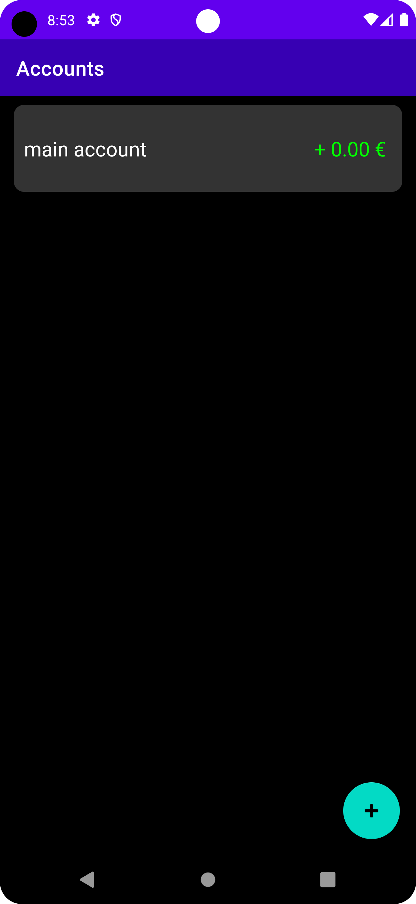
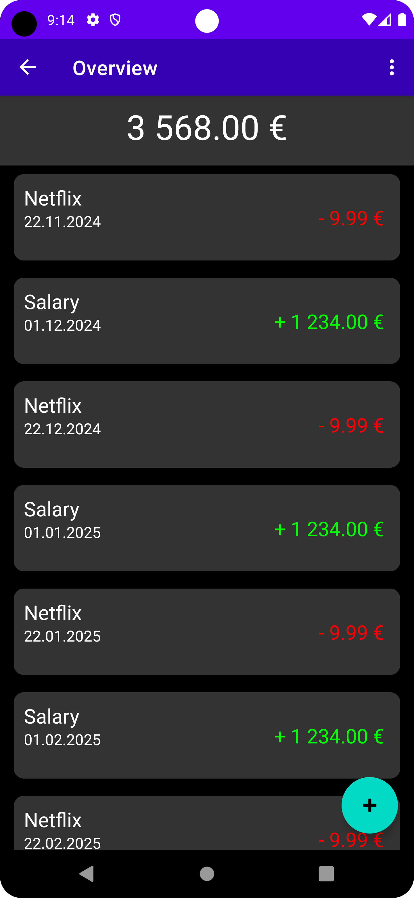
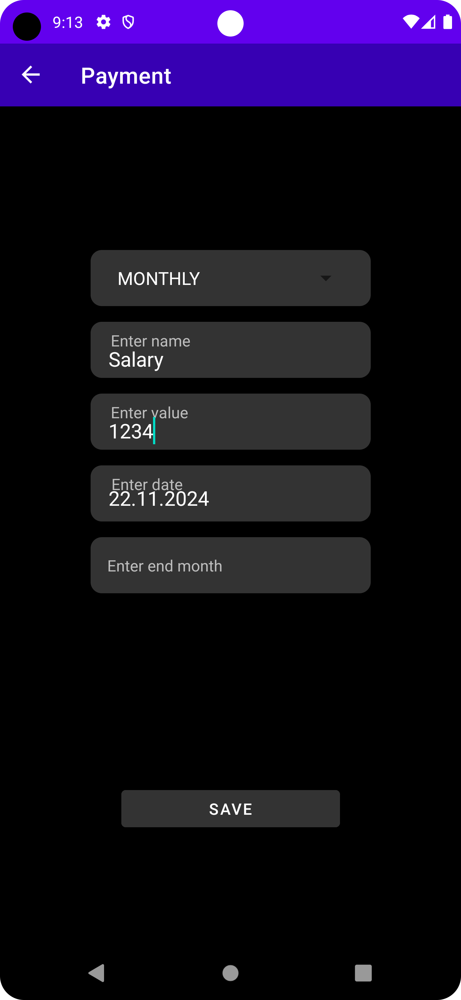

# Stay positive
This app was created out of the idea to look into the future of your bank account to check if you have a moment where you bank account goes negative. Combined with the little scroll into the future feature which i saw where else i thought it would be a fun little app. Maybe the idea will be improved in the future.

  

## Features
- Add/edit/remove bank accounts
- Add/edit/remove payments/incomes
- Scroll into the future and watch your bank account growing (hopefully not shrinking)
- Calculate the past when open up the app

## Setup
### 1. Download the app(.apk)
Please take a look at the release tab here in the repository.
### 2. Install the app(.apk)
You have to allow installing apps from unknown sources via settings.
### 3. Use it!

# Development information
This project was created with android studio so for a struggle-less start you also should use it!